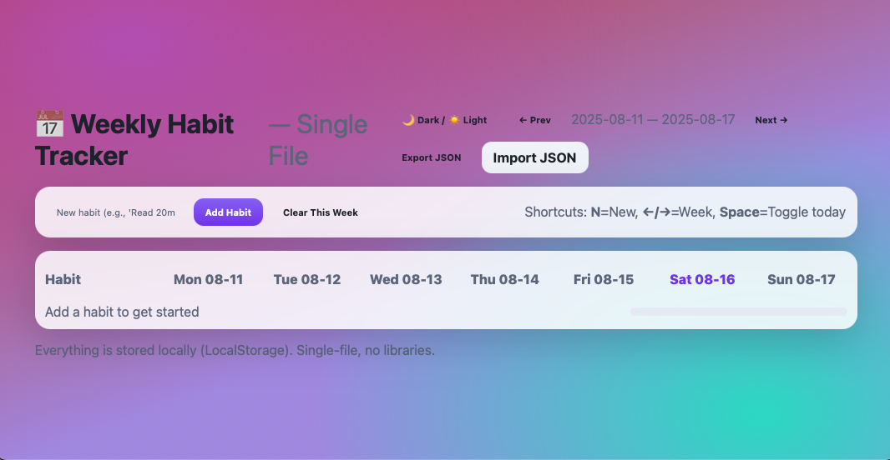
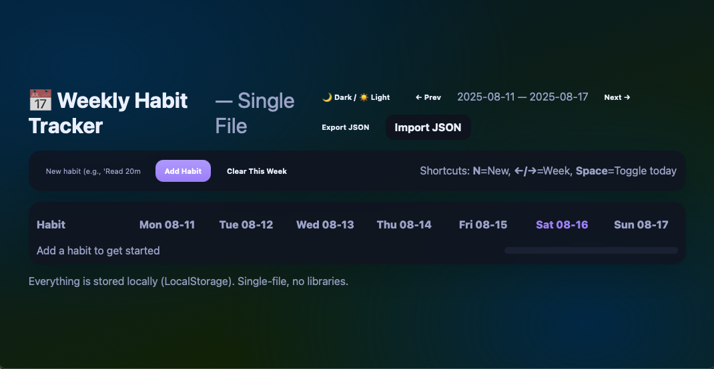

# 📅 Weekly Habit Tracker (Single‑File App)

A minimal, local‑first **weekly habit grid** that runs entirely in your browser. No backend, no build step — **one `index.html`** does it all.

* 🗓️ Monday→Sunday grid with week navigation
* ✅ Click‑to‑check cells, per‑week totals & progress bar
* 💾 LocalStorage persistence (offline‑ready)
* 🌓 Light/Dark themes with memory
* 📤 Export / 📥 Import JSON backup (habits + checks)

## 📸 Screenshots

### Light



### Dark




## 🚀 Quick Start

```text
Weekly Habit Tracker/
├─ index.html
├─ Screenshot1.png
└─ Screenshot2.png
```

1. Open `index.html` in your browser.
2. Add a habit from the toolbar (e.g., **Read 20min**).
3. Click daily cells to mark completion.
4. Use **Prev/Next** to navigate weeks.
5. Back up with **Export JSON**; restore with **Import JSON**.

> Everything stays on your device (LocalStorage). Works offline.


## ✨ Features

* **Weekly grid** (Mon–Sun) with date labels for the current view
* **Quick add** / delete habits
* **Inline rename**: double‑click habit title to edit
* **Progress summary**: total checks and a weekly progress bar
* **Theme memory**: remembers Light/Dark between sessions


## ⌨️ Shortcuts

* `N` — Focus the **New habit** field
* `← / →` — Previous / next week
* `Space` — Toggle the **last day** of the **last habit** (quick check‑off)


## 🧠 How It Works

Data is stored in LocalStorage under two keys:

* `whabits_v1_habits`: list of habits
* `whabits_v1_checks`: checkmarks per habit per day

**Habit object**

```json
{
  "id": "x1a9bz",
  "title": "Read 20min",
  "created": 1733616000000
}
```

**Checks map**

```json
{
  "x1a9bz": {
    "2025-08-11": true,
    "2025-08-12": true
  }
}
```

Dates use ISO format (`YYYY-MM-DD`) based on your local timezone. Weeks start on **Monday**.


## 📤 Export / 📥 Import

* **Export JSON** downloads `weekly-habits.json` with `{ habits, checks }`.
* **Import JSON** accepts the same shape and replaces current data.

> Tip: keep your exports in a private Git repo to version your progress.


## 🛠 Customization

Tune the design tokens in the `<style>` block:

```css
/* Light */
body.theme-light{ --bg: ...; --card: ...; --text: ...; --accent: ... }
/* Dark  */
body.theme-dark{  --bg: ...; --card: ...; --text: ...; --accent: ... }
```
* Adjust cell size via `.check { width/height }` and row spacing via `.row`.
* Change start‑of‑week rules or labels in the `labels` array and `monday()` helper.


## 🧰 Tech

* Vanilla **HTML / CSS / JavaScript**
* **Single file**, no external libraries
* LocalStorage API

## 📄 License
MIT — use, fork, and modify freely.
